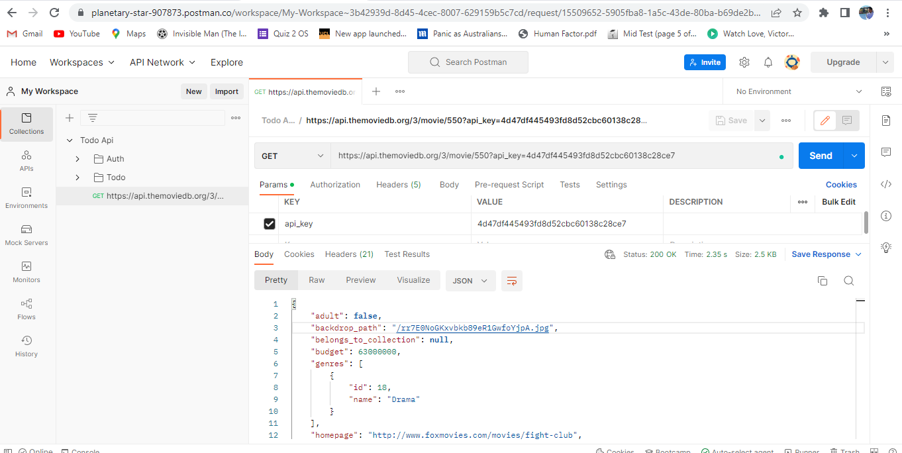
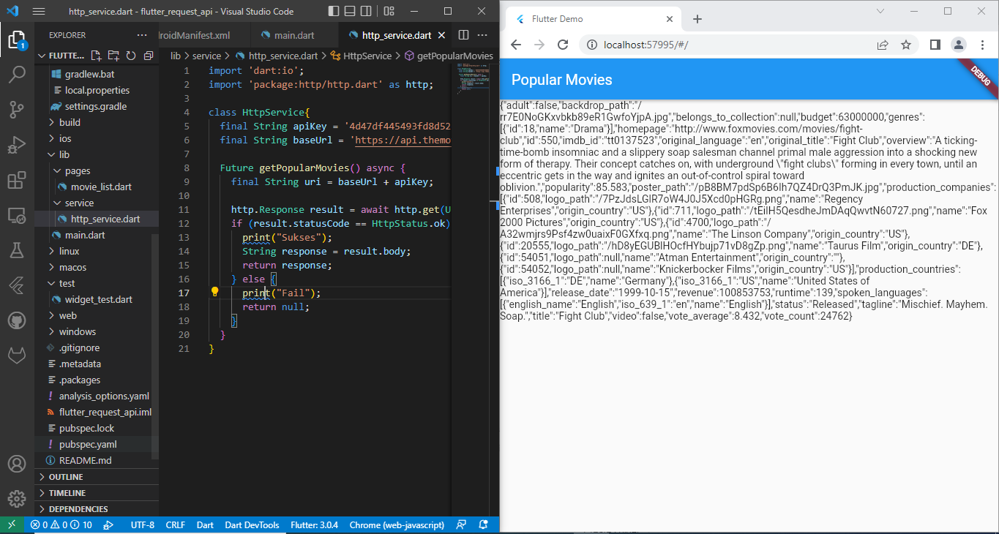
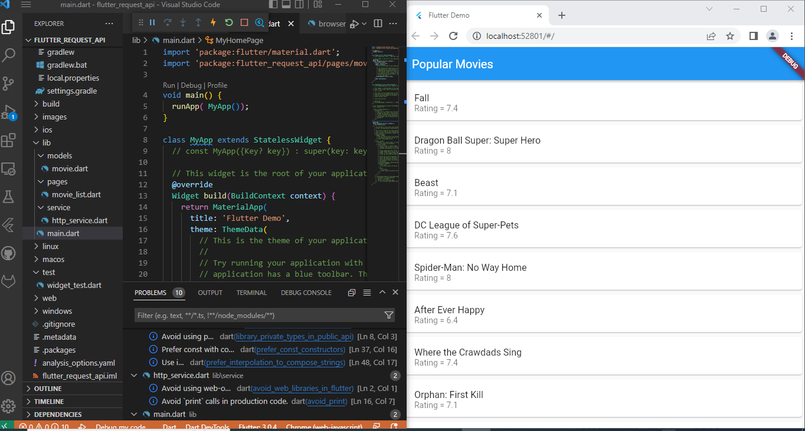
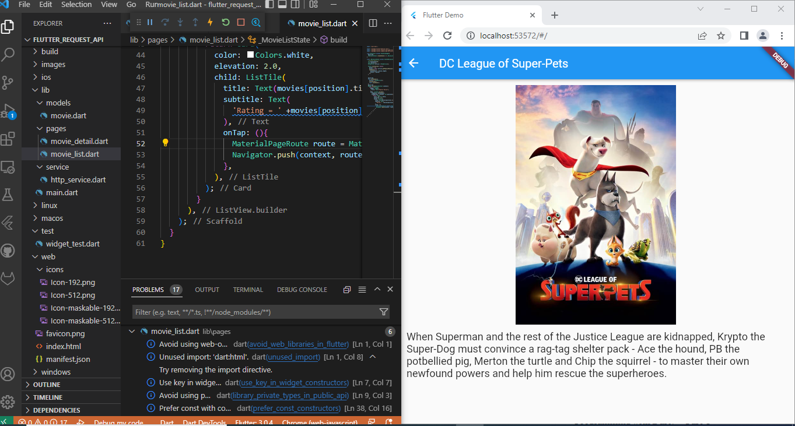

# flutter_request_api

Baggio Deroger

1. - Getting the API Key
   - Testing connection in themoviedb api dashboard

2. - Connecting Flutter Application to themoviedb with package http

=>

3. - Creating a model for http responses
   - Creating a model for http responses

=> Error when displaying the output
![Result](images/result4.PNG

  - Creating a Listview

4. - Creating Popular Movies detail page

=>

